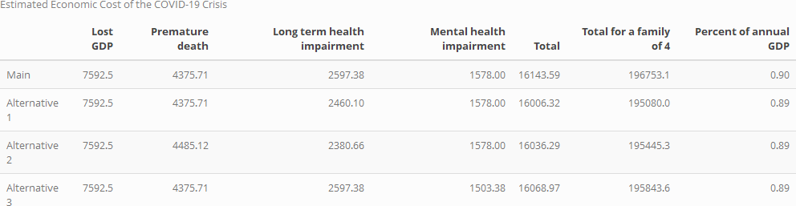

# COVID OPA Proposal

The following is an Open Policy Analysis proposal for *The COVID-19 Pandemic and the $16 Trillion Virus* by David M. Cutler and Lawrence Summers, published in JAMA in October of 2020. The analysis is based on the paper's [Appendix](https://scholar.harvard.edu/files/cutler/files/cs_appendix.pdf) and a provided [replication model](https://github.com/petezh/ACRE-Cutler-Summers/blob/main/resources/model%20replication.xlsx).

### Overview

The paper seeks to model the economic cost of the pandemic along four dimensions:

1. *Lost GDP*: Depressed 10-year economic activity induced by the COVID-19 recession.
2. *Mortality*: Pre-mature mortality in the form of lives lost due to COVID-19 and related factors.
3. *Impairments*: Decreased quality of life due to permanent impairments (e.g. lung damage) from COVID-19.
4. *Mental Health*: Decreased quality of life due to decreased mental well-being in the form of anxiety and depression.

The existing reproduction package is mapped by the following diagram:

```
 Table 1
  └── analysis.R
      ├── projections.csv
      │   └── cleaning.R
      │       ├── cbo-2020-01-economicprojections.xlsx
      │       └── cbo-2020-07-economicprojections.xlsx
      ├── impairments.csv
      │   └── cleaning.R
      │       ├── covid_by_age.csv
      │       │   └── manual
      │       │       └── covid_by_age_snapshot.pdf
      │       └── covasim.csv
      │           └── manual
      │               └── covasim.pdf
      ├── covid_deaths.csv
      │   └── cleaning.R
      │       └── covid19-death-counts.csv
      └── mental_health.csv
          └── cleaning.R
              ├── 2019nchsmentalhealth.csv
              │   └── manual
              │       └── 2019mentalhealth.pdf
              ├── 2019gender_table1.xlsx
              └── 2020pulsementalhealth.csv
```

### Materials

#### Raw

The paper draws on the following raw data sources:

- Weekly COVID-19 death counts from the [CDC](https://data.cdc.gov/NCHS/Provisional-COVID-19-Death-Counts-by-Week-Ending-D/r8kw-7aab).
- A September [snapshot](https://www.ozarkfinancialnwa.com/files/53596/FirstTrust.Covid-19Tracker.2020.09.10.pdf) of COVID-19 deaths counts by age and gender from the [CDC](https://www.cdc.gov/nchs/nvss/vsrr/covid_weekly/index.htm).
- Results from the [NCHS](https://www.cdc.gov/nchs/covid19/pulse/mental-health.htm) Pulse mental health survey.
- 2019 mental health estimates from the [NCHS](https://www.cdc.gov/nchs/data/nhis/earlyrelease/ERmentalhealth-508.pdf).
- January and July 2020 10-year GDP projections from the [CBO](https://www.cbo.gov/data/budget-economic-data#4).
- The 2019 [American Community Survey](https://www2.census.gov/programs-surveys/demo/tables/age-and-sex/2019/age-sex-composition/) (ACS).
- Results from the [Covasim](https://www.medrxiv.org/content/10.1101/2020.05.10.20097469v2) model of COVID-19 dynamics.

The sources are not provided in the original reproduction package, but are compiled [here](https://github.com/petezh/ACRE-Cutler-Summers/tree/main/data/raw).

#### Analytic

Each of the 4 outputs corresponds to an analytic dataset. These include the following:

- `projections.csv` - Pre- and post-COVID 10-year GDP projections.
- `covid_deaths.csv` - CDC COVID-19 deaths estimates.
- `impairments.csv` - impairment data from COVID-19 deaths by age and Covasim model.
- `mental_health.csv` - Compiled results from 2019 and 2020 mental health surveys.

The datasets can be generated fairly easily from the raw data, with little cleaning or computation required.

### Analysis

#### Method

The authors reach their estimates by using multiples established in previous research. For example, to estimate the value of impairments, they use the following formula:
$$
Current\ Deaths \cdot \frac{Total\ Deaths}{Current\ Deaths} \cdot \sum_{age} Impairment\ Rate_{age} \cdot\\ Prop\ of\ Deaths\ \cdot (1/3) * VSL
$$
Each of the input ratios or factors is derived from data, results of prior research, or the authors' conservative estimates.

#### Robustness Checks

The following are possible robustness checks:

1. *Change Future Ratio* - The ratio of total (current + future) deaths to current deaths, used to project future impairments. The authors estimate the value to be "625,000/250,000", which appears unjustified by their own estimates. The value is recomputed using the deaths estimates.
2. *Update COVID-19 Deaths* - The new COVID-19 death counts by the CDC yield a greater estimate of deaths by September 25th. The updated value is added to the model.
3. *Change Adult Population* - The authors use a value of 263,000,000 for the number of American adults, which is then used to compute mental health impairments. The ACS indicates that the number of adults is 250,563,000.
4. *COVASIM* - Vary estimates for proportions of impairments by age bracket.
5. *VSL* - Change value of a statistical life.

### Output

#### Table 1

Estimates of the four previous results.



#### Figure 1

Plot of GDP projections.


#### Figure 2

Graph of monthly COVID deaths.


### Citations

Cutler DM, Summers LH. The COVID-19 Pandemic and the $16 Trillion Virus. JAMA. 2020;324(15):1495–1496. doi:10.1001/jama.2020.19759


