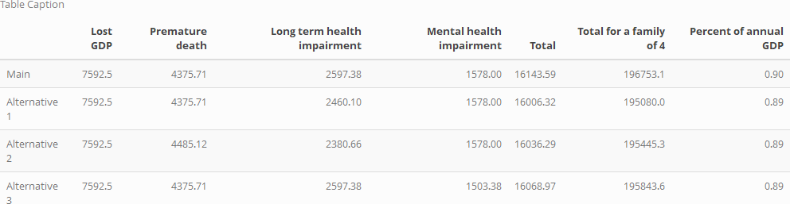

# Reproduction Package for "The COVID-19 Pandemic and the $16 Trillion Virus"

This is a reproduction package for "The COVID-19 Pandemic and the $16 Trillion Virus" by [Cutler and Summers (2020)](https://jamanetwork.com/journals/jama/fullarticle/2771764). The effort followed the [Guide for Accelerating Computational Reproducibility](https://bitss.github.io/ACRE/) (ACRE) from the [Berkeley Initiative for Transparency in the Social Sciences](https://www.bitss.org/) (BITSS). The reproduction attempt is logged [here](https://www.socialsciencereproduction.org/reproductions/af00dae3-c8b7-47e8-957c-415c6e213f74/index) on the [Social Science Reproduction Platform](https://www.socialsciencereproduction.org/) (SSRP). For interested reproducers, this record also includes suggestions for potential improvements.

The data and calculations were based on the [Appendix](https://scholar.harvard.edu/files/cutler/files/cs_appendix.pdf) and a provided [replication model](https://github.com/petezh/ACRE-Cutler-Summers/blob/main/resources/model%20replication.xlsx), which are available in the `resources` folder.

### Description

An installation of [R](https://cran.r-project.org/mirrors.html) will be required to run the analysis and cleaning scripts.

The following is a diagram of all inputs and outputs, where "manual" indicates a manual transcription:

```
  Table 1
  └── analysis.R
      ├── projections.csv
      │   └── cleaning.R
      │       ├── cbo-2020-01-economicprojections.xlsx
      │       └── cbo-2020-07-economicprojections.xlsx
      ├── impairments.csv
      │   └── cleaning.R
      │       ├── covid_by_age.csv
      │       │   └── manual
      │       │       └── covid_by_age_snapshot.pdf
      │       └── covasim.csv
      │           └── manual
      │               └── covasim.pdf
      ├── covid_deaths.csv
      │   └── cleaning.R
      │       └── covid19-death-counts.csv
      └── mental_health.csv
          └── cleaning.R
              ├── 2019nchsmentalhealth.csv
              │   └── manual
              │       └── 2019mentalhealth.pdf
              ├── 2019gender_table1.xlsx
              └── 2020pulsementalhealth.csv
```

The reproduction is based on the following data sources, which are available in the `data/raw` subfolder:

- Weekly COVID-19 death counts from the [CDC](https://data.cdc.gov/NCHS/Provisional-COVID-19-Death-Counts-by-Week-Ending-D/r8kw-7aab).
- A September [snapshot](https://www.ozarkfinancialnwa.com/files/53596/FirstTrust.Covid-19Tracker.2020.09.10.pdf) of COVID-19 deaths counts by age and gender from the [CDC](https://www.cdc.gov/nchs/nvss/vsrr/covid_weekly/index.htm).
- Results from the [NCHS](https://www.cdc.gov/nchs/covid19/pulse/mental-health.htm) Pulse mental health survey.
- 2019 mental health estimates from the [NCHS](https://www.cdc.gov/nchs/data/nhis/earlyrelease/ERmentalhealth-508.pdf).
- January and July 2020 10-year GDP projections from the [CBO](https://www.cbo.gov/data/budget-economic-data#4).
- The 2019 [American Community Survey](https://www2.census.gov/programs-surveys/demo/tables/age-and-sex/2019/age-sex-composition/) (ACS).
- Results from the [Covasim](https://www.medrxiv.org/content/10.1101/2020.05.10.20097469v2) model of COVID-19 dynamics.

The raw data are processed by the `cleaning.R` script, which outputs the following analysis datasets to the `data/analysis` subfolder:

- `covid_deaths.csv` - CDC COVID-19 deaths estimates.
- `impairments.csv` - impairment data from COVID-19 deaths by age and Covasim model.
- `mental_health.csv` - Compiled results from 2019 and 2020 mental health surveys.
- `projections.csv` - Pre- and post-COVID 10-year GDP projections.

The `analysis.R` script accepts these datasets as inputs, as well as other estimates outlined in the  [Appendix](https://scholar.harvard.edu/files/cutler/files/cs_appendix.pdf). It produces both figures from the appendix, `gdp_fig.png` and `deaths_fig.png`, and saves them to the `results` folder. The script then uses the authors' methodology to estimate the cost of the COVID pandemic.

### Robustness Checks

After verifying the authors' estimate, it adopts the following alternative parameters:

1. *Change Future Ratio* - The ratio of total (current + future) deaths to current deaths, used to project future impairments. The authors estimate the value to be "625,000/250,000", which appears unjustified by their own estimates. The value is recomputed using the deaths estimates.
2. *Update COVID-19 Deaths* - The new COVID-19 death counts by the CDC yield a greater estimate of deaths by September 25th. The updated value is added to the model.
3. *Change Adult Population* - The authors use a value of 263,000,000 for the number of American adults, which is then used to compute mental health impairments. The ACS indicates that the number of adults is 250,563,000.

### Results

The table of results, for both the author's specifications and the three alternatives, is stored as `results_fig.png` and is displayed below.


